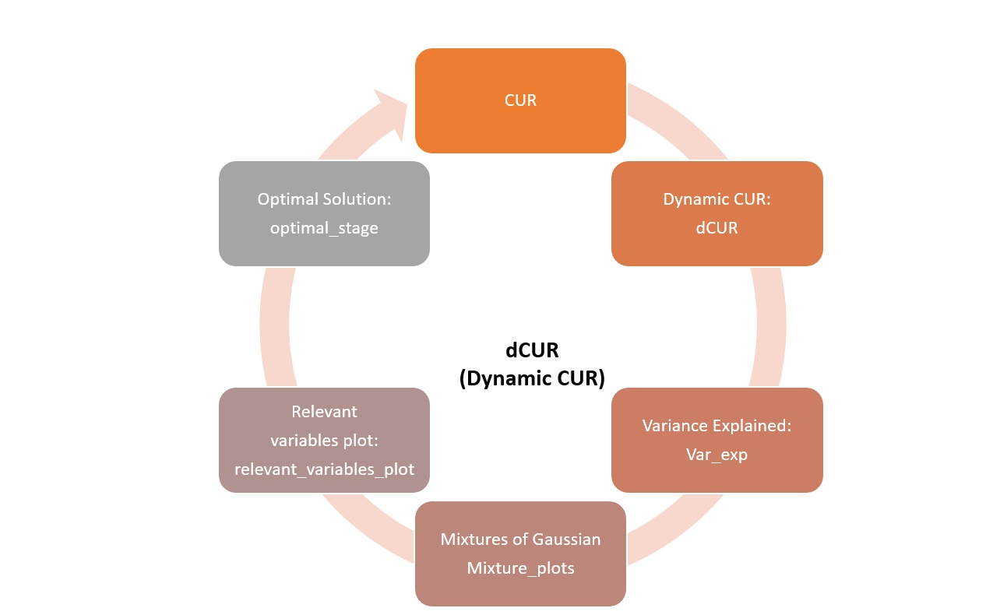

# dCUR <a href='https://www.cesargamboasanabria.com'></a>


The CUR theoretical basis comes from the SVD of the matrix of interest to make a new factorization by selecting columns and rows from the original matrix. It is a low-rank approximation to the original matrix expressed in a small number of rows and columns, which are easier to interpret than the singular vectors of the SVD. The main advantage of CUR Decomposition over SVD is that the original data matrix can express a reduced number of rows and columns instead of obtaining factorial axes resulting from a linear combination of all the original variables.

</a>

# Installation

You can install the **development** version from [Github](https://github.com/cgamboasanabria/dCUR)

````
remotes::install_github("cgamboasanabria/dCUR")
````

# Usage

## var_exp

````
var_exp(AASP, standardize = TRUE, hoessem:notabachillerato)
````
## CUR


````
CUR(data=AASP, variables=hoessem:notabachillerato,
                 k=20, rows = 1, columns = .2, standardize = TRUE,
                 cur_method = "sample_cur")

CUR(data=AASP, variables=hoessem:notabachillerato,
                 k=20, rows = 1, columns = .2, standardize = TRUE,
                 cur_method = "sample_cur", correlation = R1, correlation_type = "partial")

CUR(data=AASP, variables=hoessem:notabachillerato,
                 k=20, rows = 1, columns = .2, standardize = TRUE,
                 cur_method = "sample_cur", correlation = R1, correlation_type = "partial")

CUR(data=AASP, variables=hoessem:notabachillerato,
                 k=20, rows = .9999999, columns = .10, standardize = TRUE,
                 cur_method = "mixture")
````

## relevant_variables_plot

````
results <- CUR(data=AASP, variables=hoessem:notabachillerato,
               k=20, rows = 1, columns = .2, standardize = TRUE,
               cur_method = "sample_cur")
relevant_variables_plot(results)
````

## mixture_plots

````
results <- CUR(data=AASP, variables=hoessem:notabachillerato,
               k=20, rows = .9999999, columns = .10, standardize = TRUE,
               cur_method = "mixture")
mixture_plots(results)
````

## dCUR

````
dCUR(data=AASP, variables=hoessem:notabachillerato,
                     k=20, rows=.5, columns=.5, standardize=TRUE, 
                     cur_method="sample_cur", method="pearson",
                     parallelize =TRUE, dynamic_columns  = TRUE, 
                     dynamic_rows  = TRUE, correlation = R1, 
                     correlation_type = "partial")
````

## optimal_stage

````
results <- dCUR(data=AASP, variables=hoessem:notabachillerato,
                     k=20, rows=.5, columns=.5, standardize=TRUE, 
                     cur_method="sample_cur", method="pearson",
                     parallelize =TRUE, dynamic_columns  = TRUE, 
                     dynamic_rows  = TRUE, correlation = R1, 
                     correlation_type = "partial")
optimal_stage(results)
````

# License

This package is free and open source software, licensed under GPL-3.
